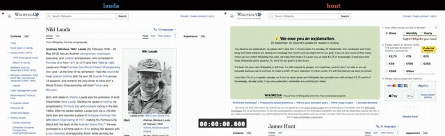

# 🏁 RaceForThePrize

[](https://www.npmjs.com/package/race-for-the-prize)

**Ladies and gentlemen, welcome to race day!**

RaceForThePrize is a command-line showdown that pits browsers against each other in head-to-head performance battles. Line up 2 to 5 racers, write your [Playwright](https://playwright.dev/) scripts, fire the starting gun, and watch them tear down the track side by side — live terminal animation, video recordings, and a full race report that crowns the champion.

No judges, no bias — just cold, hard milliseconds on the clock.

📖 **[Read the docs](https://kertal.github.io/race-for-the-prize/)** · 🏎️ [Demo races](docs/demos.md) · 🛠️ [Write your own](docs/writing-races.md)

## The Starting Grid

Nothing to clone. One command and the first race is on:

```bash
npx race-for-the-prize demo:lauda-vs-hunt
```

Racing more than once? Install it globally and race from any directory:

```bash
npm install -g race-for-the-prize

race-for-the-prize demo                   # list the bundled demo races
race-for-the-prize demo:lauda-vs-hunt     # run one
race-for-the-prize --init my-race         # scaffold your own race into my-race/
race-for-the-prize my-race                # run it
```

You need **Node.js 18+**. Chromium is downloaded automatically by the package's `postinstall` step, and FFmpeg is optional — only `--ffmpeg` wants it. New to Node or stuck on your platform? The **[Installation Guide](INSTALLATION.md)** walks through macOS, Linux and Windows step by step.

## Race Day: Lauda vs Hunt

The classic rivalry. Niki Lauda — "The Computer" — against James Hunt — "The Shunt". Precision vs raw speed. Two browsers launch, two Wikipedia pages load, then they scroll — human-like, pixel by pixel — to the bottom. Who reaches the finish line first?

```bash
race-for-the-prize demo:lauda-vs-hunt
```



🎬 **[Open the replay ↗](https://kertal.github.io/race-for-the-prize/demos/race_hunt_vs_lauda.html)** — the actual report this race produced: scrub the video, jump between sections, read the profile.

Three more races are in the garage, two of them with a replay to watch right now: the GOAT debate (`demo:lebron-vs-curry`, [replay ↗](https://kertal.github.io/race-for-the-prize/demos/race_curry_vs_lebron.html)), a four-way framework cage match (`demo:react-vs-angular`, [replay ↗](https://kertal.github.io/race-for-the-prize/demos/race_frameworks.html)), and a cache bake-off (`demo:caching-comparison`). See **[Demo Races](docs/demos.md)** for the full grid.

## What You Get

- 🏎️ A **live terminal animation** while the browsers slug it out
- 🎬 An **interactive HTML player** with frame-accurate side-by-side replay
- 📊 **Bar charts and medals** per timed section, and an overall winner
- 📈 **Performance profiles** from the Chrome DevTools Protocol — transfer size, script time, layout, TTFB, FCP, LCP, CLS
- 🌧️ **Track conditions** on demand: network throttling, CPU ballast, repeated runs with a median
- 🗂️ A **results folder you can reread months later** — videos, traces, report card, and the exact configuration the race ran with

## The Pit Wall — Documentation

| Where to go | What's there |
|---|---|
| **[Demo Races](docs/demos.md)** | The four bundled races and how the copy-before-run step works |
| **[Writing Your Own Race](docs/writing-races.md)** | Multi-spec and shared-spec modes, the race API, setup/teardown scripts |
| **[Use Cases](docs/use-cases.md)** | A/B tests, framework shoot-outs, third-party script cost, mobile conditions |
| **[Race Flags and Settings](docs/cli.md)** | Every CLI flag, the throttling presets, the full `settings.json` reference |
| **[Reading the Results](docs/results.md)** | The results folder, the HTML player, the performance matrix, the podium |
| **[Skinning the Player](docs/skinning.md)** | Design tokens and how to theme a report |
| **[Installation Guide](INSTALLATION.md)** | Node, Chromium and FFmpeg on every platform |
| **[Working on the Tool](docs/development.md)** | Running from a clone, project structure, tests, the slide deck |

## A Word From the Stewards

The aim here is not laboratory accuracy — it's to *showcase* performance, to make it visible, to compare how a page behaves under different conditions. Video recording and frame trimming are side effects on top of the side effects every browser metric already carries. Question the numbers, double-check the findings, and treat the tool as a storyteller with a stopwatch rather than an oracle.

## Standing on the Shoulders of Giants

- Built by [@kertal](https://github.com/kertal). More contributors very welcome!
- Built on top of the mighty [Playwright](https://playwright.dev/) — the browser automation framework that makes all of this possible.
- Built with support of the great "[Race for the Prize](https://www.youtube.com/watch?v=bs56ygZplQA)" song by [The Flaming Lips](https://www.flaminglips.com/).

## License

MIT
